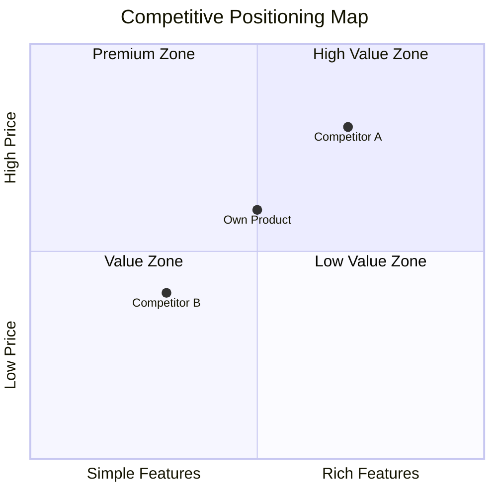

# Comprehensive Competitor Analysis

## Core Principles

1. **Multi-source cross-validation** — Competitor intelligence from a single data source is unreliable; every key finding must be cross-validated by at least 2 independent sources; strategic inference confidence is highest when hiring + financing + feature update signals converge
2. **Change equals signal** — Every feature change, pricing adjustment, and hiring shift of a competitor is a strategic signal, not an isolated event; must be interpreted in context rather than simply listed
3. **Tiered alert response** — P0 level (impact ≥5) urgent notification + mark for emergency response, P1 level (impact =4) immediate notification + include in weekly report, P2 level (impact <4) include in weekly report only; resource allocation matches impact level
4. **Strategic inference annotated with confidence** — Hiring-inferred strategic direction confidence 0.5-0.7, financing + hiring dual signal 0.7-0.9, official announcement 0.9+; low-confidence inferences must be escalated for human verification
5. **Four-quadrant definitions first** — Direct/indirect/substitute/potential quadrants have strict definitions (same category + same users + same features / same scenario + different solution / non-productized method / capable of entering); classification must be based on definitions, not intuition
6. **Inter-quadrant flow trackable** — Competitors are not statically assigned to one quadrant; indirect competitors may upgrade to direct competitors, potential competitors may become direct competitors; annotate flow signals and estimated timelines
7. **Potential competitors default to requiring validation** — Every item in the potential competitor quadrant defaults to needs_human_validation=true, because potential competitor identification is based on inferred signals (hiring/patents/financing) with the highest uncertainty
8. **Empty quadrant equals risk indicator** — Any empty quadrant is not "no competitors" but "competitors not identified"; must annotate that the quadrant needs supplementation and suggest human provide leads
9. **Data-driven conclusions first** — Every conclusion must be supported by data or evidence; baseless inferences are prohibited
10. **Structured output is deliverable** — Reports are for decision-makers, not for AI; readability is priority
11. **Insight over data dumping** — Data is a means, insight is the purpose; every piece of data must answer "so what"
12. **Actionable recommendations** — Strategy recommendations must be specific enough to include "what to do + why + expected effect"

## Interaction Mode

🤖→👤 AI suggests, human approves

## Input

| Input Item | Type | Required | Source | Description |
|--------|------|------|------|------|
| competitor_list | array | Yes | User provided | Competitor list, each item containing name, category, website URL |
| category_keywords | string | Yes | User provided | Category keywords, e.g., "online education", "SaaS CRM" |
| monitor_config | object | No | User provided | Monitoring configuration, including scan frequency, focus dimensions, alert thresholds |
| Market size data | JSON | No | output/pm-discovery/market-tam-som/tam-som.json | TAM/SAM/SOM and growth rates |
| Macro environment data | JSON | No | output/pm-discovery/market-pest/pest.json | PEST four-dimension trends |
| Own product information | string/markdown | No | User provided | Own product positioning, core features, target users, current status |

## Execution Steps

### Step 1: Competitor Intelligence Collection [Core]

Multi-source information collection covering all aspects of competitor dynamics:

| Collection Source | Collection Content | Collection Frequency |
|--------|---------|---------|
| App version update monitoring | Version number, changelog, feature changes, release time | Each version release |
| Website/blog updates | Product page changes, new feature announcements, strategy articles, pricing page changes | Daily |
| App review collection | User ratings, review content, sentiment tendency, high-frequency keywords | Weekly |
| Pricing page monitoring | Price changes, plan adjustments, promotional activities, new pricing models | Daily |
| Job posting monitoring | New positions, position quantity changes, tech stack requirements, geographic distribution | Weekly |
| Industry news/financing information | Financing round amounts, strategic partnerships, M&A, industry rankings | Real-time |

**Job posting strategic inference rules:**
- Large-scale hiring for specific tech stack positions → Infer technology direction investment
- New overseas positions → Infer internationalization strategy
- Sharp decline in hiring volume → Infer cost contraction or strategic adjustment
- New AI/ML positions → Infer intelligence direction

#### Feature Matrix Auto-Update [Conditional]

| Step | Description |
|------|------|
| Detect version update | Get version update information from collection layer |
| Extract feature changes | Parse changelog, extract added/upgraded/removed features |
| Compare with existing matrix | Compare with Feature Matrix, annotate change type |
| Assess impact level | 1-5 score assessing impact on competitive landscape |
| Trigger alert | Real-time alert when impact level ≥4 |

**Change type definitions:**
- Added: Competitor adds a feature not previously available
- Upgraded: Competitor makes significant improvements to an existing feature
- Removed: Competitor discontinues a feature
- Downgraded: Competitor limits or degrades an existing feature

#### Competitor User Reputation Comparison [Conditional]

| Analysis Dimension | Description |
|---------|------|
| Sentiment distribution comparison | Compare positive/neutral/negative sentiment proportions across competitors |
| High-frequency pain point comparison | Extract top pain points for each competitor, cross-compare |
| Differentiation opportunities | Identify common pain points across competitors, mark as differentiation opportunities |
| Competitive disadvantage alert | Identify reputation disadvantage items relative to competitors |
| User migration signals | Detect reviews where competitor users express dissatisfaction or migration intent |

#### Pricing Strategy Comparison [Conditional]

| Analysis Dimension | Description |
|---------|------|
| Price range comparison | Compare pricing ranges and average prices across competitors |
| Plan structure comparison | Compare free/basic/pro/enterprise feature distribution |
| Pricing model changes | Detect pricing model changes (e.g., usage-based → subscription) |
| Value for money assessment | Feature coverage/price ratio comparison |

#### Feature Update Interpretation [Deep]

- Strategic intent interpretation of feature changes
- Impact assessment on user value
- Impact assessment on competitive landscape
- Recommended response measures

#### Strategic Direction Inference [Deep]

Synthesize hiring, financing, feature updates, pricing changes, and other multi-source signals to infer competitor strategic directions:
- Market expansion / contraction direction
- Technology investment direction
- Target customer segment migration direction
- Business model evolution direction

### Step 2: Four-Quadrant Positioning [Core]

#### Direct Competitor Identification

**Definition:** Same category + same target users + same core features

**Identification logic:**
1. Filter competitors with exactly matching categories from the known competitor list
2. Search app store same-category products based on category keywords
3. Search product directories/industry databases for same-category products
4. SEO competitor analysis (competitor bidding on same core keywords)

**Data sources:**

| Data Source | Collection Content | Reliability |
|--------|---------|--------|
| App store categories | Product list under same category | High |
| Product directories (e.g., G2/Capterra) | Same-category product comparison lists | High |
| SEO competitor analysis | Competitors bidding on same keywords | Medium |
| Industry associations/databases | Industry members/certified products | High |

#### Indirect Competitor Identification

**Definition:** Same user scenario + different solution

**Identification logic:**
1. Analyze target user scenarios, list all possible solutions
2. Extract alternative products mentioned in user feedback
3. Search term analysis: other products users search for alongside category keywords
4. Identify products that solve the same scenario but with different technology paths/business models

**Data sources:**

| Data Source | Collection Content | Reliability |
|--------|---------|--------|
| User feedback alternatives | Alternative products mentioned in user reviews | Medium |
| Search term association analysis | Associated search terms for category keywords | Medium |
| Scenario mapping analysis | Products with different solutions for same scenario | Medium |
| Community/forum discussions | Alternative recommendations in user discussions | Medium |

#### Substitute Identification

**Definition:** Users' current non-productized solutions

**Identification logic:**
1. Identify how target users solve the problem without products in this category
2. Extract current workflows/manual processes from user interview data
3. Collect non-productized alternatives from survey questionnaires
4. Extract DIY solutions/manual processes from forum/community discussions

**Data sources:**

| Data Source | Collection Content | Reliability |
|--------|---------|--------|
| User interview data | Current solutions described by users | High |
| Survey questionnaires | Alternative methods chosen by users | High |
| Forums/communities | DIY solutions, manual process discussions | Medium |
| Industry reports | Proportion of non-productized solutions in industry | Medium |

#### Potential Competitor Identification

**Definition:** Companies capable of entering this field

**Identification logic:**
1. Job posting monitoring: Detect hiring for relevant tech/marketing positions
2. Patent analysis: Search patent applications in relevant technology fields
3. Financing information: Monitor companies receiving financing in relevant fields
4. Strategic announcements: Analyze relevant directions mentioned in company strategies

**Data sources:**

| Data Source | Collection Content | Reliability |
|--------|---------|--------|
| Job postings | Relevant tech/marketing position hiring | Low-Medium |
| Patent databases | Relevant technology patent applications | Medium |
| Financing information | Financing events in relevant fields | Medium |
| Strategic announcements | Relevant directions mentioned in company strategies | Low-Medium |
| Value chain analysis | Upstream/downstream enterprise extension capabilities | Low |

#### Confidence Assessment and Human Validation Annotation [Conditional]

Confidence assessment for each item in each quadrant:

| Assessment Dimension | Description |
|---------|------|
| Data source reliability | Trustworthiness of data source (0-1) |
| Evidence sufficiency | Quantity and quality of evidence supporting the classification |
| Classification certainty | Degree of certainty in assigning the competitor to this quadrant |

**Confidence levels:**
- High (0.8-1.0): Multi-source cross-validation, classification certain
- Medium (0.5-0.8): Data-supported but single source or partially contradictory
- Low (<0.5): Inferred conclusion, requires human verification

#### Inter-Quadrant Flow Annotation [Deep]

Assess inter-quadrant flow possibility for identified competitors:

| Flow Type | Trigger Signal | Estimated Timeline |
|---------|---------|-----------|
| Indirect → Direct | Indirect competitor launches same-category product line, feature convergence | 6-18 months |
| Potential → Direct | Potential competitor officially launches similar product, completes market validation | 12-24 months |
| Potential → Indirect | Potential competitor launches differentiated solution targeting same scenario | 6-12 months |
| Substitute → Indirect | Non-productized method becomes productized (e.g., toolification, platformization) | 12-36 months |

**Flow annotation rules:**
- Each competitor item may optionally include `flow_signal` (flow signal description) and `estimated_flow_timeline` (estimated flow timeline)
- Only annotate flow when there are clear signals; leave blank if no signals
- Flow signals must be accompanied by data sources

### Step 3: Competitor Analysis Report [Core]

#### Data Integration and Competitor Profile Construction

Integrate Step 1 and Step 2 data to construct complete profiles for each core competitor:

| Profile Dimension | Data Source | Description |
|----------|---------|------|
| Product positioning | Step 1 / User provided | One-sentence positioning, target users, core value proposition |
| Feature matrix | Step 1 → feature_matrix | Feature coverage comparison, annotate differentiated features |
| User reputation | Step 1 → reputation | Sentiment distribution, top pain points, user migration signals |
| Pricing strategy | Step 1 → pricing | Price range, plan structure, value for money assessment |
| Business model | User provided / AI inferred | Revenue model, customer acquisition method, growth strategy |
| Team and financing | User provided / AI inferred | Team size, financing round, capital reserves |
| Strategic direction | Step 1 → strategic_signals | Inferred strategic focus and confidence |

**Competitor selection rules:**
- Deep profile count: 3-5 core competitors (direct competitors prioritized)
- When exceeding 5, sort by threat level and take Top 5
- Indirect/substitute competitors: 1-2 representative cases each

#### SWOT Analysis (Per Competitor) [Conditional]

Generate SWOT analysis for each core competitor:

**Strengths**:
- Extract features unique or leading for this competitor from feature_matrix
- Extract dimensions with concentrated positive reviews from reputation
- Extract pricing advantages from pricing

**Weaknesses**:
- Extract high-frequency pain points from reputation.top_pain_points
- Extract missing features from feature_matrix
- Extract value-for-money disadvantages from pricing

**Opportunities**:
- Common pain points in competitor reputation → own differentiation opportunities
- Blank areas in competitor strategic directions
- Uncovered segments in market growth

**Threats**:
- Features competitors are about to launch (inferred from strategic_signals)
- Competitor price reduction or freemium trends
- Potential competitor entry signals

**SWOT Cross-Strategy Matrix**:

| Cross | Strategy Type | Description |
|------|---------|------|
| S+O | Growth strategy | Use strengths to seize opportunities |
| W+O | Improvement strategy | Address weaknesses to seize opportunities |
| S+T | Defense strategy | Use strengths to counter threats |
| W+T | Crisis contingency | Response when weaknesses encounter threats |

#### Competitive Positioning Map (Perceptual Map) [Conditional]

Draw competitive positioning map based on two core dimensions:

**Dimension selection rules:**
- Prioritize the 2 dimensions most important to user decision-making
- Common dimension combinations:

| Category Characteristic | Recommended X-Axis | Recommended Y-Axis |
|----------|----------|----------|
| General | Feature richness | Ease of use |
| Enterprise | Feature completeness | Price |
| Consumer | User experience | Value for money |
| Technical | Technology advancement | Ecosystem maturity |
| Vertical | Vertical depth | Horizontal coverage |

**Positioning map output** (Mermaid quadrant chart):


#### Competitive Moat Assessment [Deep]

Assess moat depth for each competitor:

| Moat Type | Assessment Dimension | Scoring Criteria |
|-----------|---------|---------|
| Network effects | Whether user growth enhances product value | 0-5 points |
| Switching costs | Cost for users to migrate to competitors | 0-5 points |
| Economies of scale | Whether scale brings cost advantages | 0-5 points |
| Brand barrier | Brand awareness and trust | 0-5 points |
| Technology barrier | Irreplaceability of core technology | 0-5 points |
| Data barrier | Irreplaceability of data accumulation | 0-5 points |
| Ecosystem barrier | Partner and integration ecosystem | 0-5 points |

**Moat depth rating:**
- Total score ≥25: Deep moat (hard to displace)
- Total score 15-24: Medium moat (room for breakthrough)
- Total score <15: Shallow moat (easy to enter)

#### Market Share Estimation [Deep]

Estimate competitive landscape based on available data:

| Estimation Method | Applicable Conditions | Data Source |
|----------|---------|---------|
| Top-down | TAM data and public market share available | Industry reports + TAM data |
| Bottom-up | Individual competitor user/revenue data available | Competitor public data |
| Relative share | Only qualitative comparison available | AI inference based on multi-source signals |

**Market concentration assessment:**
- HHI index calculation (Herfindahl-Hirschman Index)
- HHI<1500: Fragmented competition / 1500-2500: Moderately concentrated / >2500: Highly concentrated

#### Differentiation Strategy Recommendations [Conditional]

Generate differentiation strategy recommendations based on preceding analysis:

**Strategy derivation logic:**

| Analysis Input | Strategy Direction |
|----------|---------|
| Common competitor pain points | Pain point breakthrough strategy: Solve core problems no competitor has solved |
| Competitors with shallow moats | Flanking breakthrough strategy: Enter through competitors with weakest moats |
| Positioning map blank areas | Positioning gap strategy: Occupy positioning space uncovered by competitors |
| SWOT cross matrix | Leverage strategy: Use own strengths to seize opportunities exposed by competitor weaknesses |
| Fragmented market landscape | Focus strategy: Focus on one segment in a fragmented market and go deep |

**Each strategy includes:**
- Strategy name and one-sentence description
- Strategy basis (citing specific analysis data)
- Expected effect
- Risks and prerequisites
- Priority (P0/P1/P2)

#### Report Assembly

Integrate all analysis into a complete Markdown report:

**Report structure:**

```
# {Category} Competitor Analysis Report

## Executive Summary
- One-paragraph summary of competitive landscape
- 3 key findings
- Top 1 strategy recommendation

## 1. Market Overview
- Market size (TAM/SAM/SOM)
- Growth trends and drivers
- Macro environment impact (PEST key factors)

## 2. Competitive Landscape
- Four-quadrant classification overview
- Market share estimation
- Market concentration assessment

## 3. Competitor Deep Analysis
### 3.1 {Competitor A Name}
- Product profile
- SWOT analysis
- Moat assessment
### 3.2 {Competitor B Name}
- ...

## 4. Feature Matrix Comparison
- Core feature comparison table
- Differentiated feature annotation
- Feature coverage score

## 5. User Reputation Comparison
- Sentiment distribution comparison
- Top pain points cross-comparison
- Differentiation opportunity identification

## 6. Pricing Strategy Comparison
- Price range comparison
- Plan structure comparison
- Value for money assessment

## 7. Competitive Positioning Map
- Perceptual Map
- Positioning blank area analysis

## 8. Differentiation Strategy Recommendations
- Strategy 1: {Name}
- Strategy 2: {Name}
- Strategy 3: {Name}

## Appendix
- Data source list
- Confidence annotations
- Analysis methodology description
```

## Output

**Storage path**: `output/pm-discovery/market-competitor-analysis/`

**Output files**:

| File | Format | Description |
|------|------|------|
| competitor-analysis.json | JSON | Structured data (including intel data + quadrant data + report summary) |
| competitor-analysis.md | Markdown | Complete competitor analysis report |

**competitor-analysis.json Output Schema**:

```json
{
  "type": "object",
  "required": ["scan_timestamp", "competitors", "quadrants", "executive_summary", "competitor_profiles", "differentiation_strategies"],
  "properties": {
    "scan_timestamp": {"type": "string", "description": "Scan timestamp"},
    "competitors": {"type": "array", "description": "Competitor intelligence list, including Feature Matrix, reputation, pricing, and strategic signals"},
    "reputation_comparison": {"type": "object", "description": "Competitor reputation cross-comparison"},
    "alerts": {"type": "array", "description": "Competitor change alert list"},
    "category_keywords": {"type": "string", "description": "Category keywords"},
    "quadrants": {"type": "object", "description": "Four-quadrant competitor classification, including direct/indirect/substitute/potential competitors"},
    "quadrant_summary": {"type": "object", "description": "Four-quadrant classification statistical summary"},
    "report_metadata": {"type": "object", "description": "Report metadata, including category, timestamp, and confidence"},
    "executive_summary": {"type": "object", "description": "Executive summary, including competitive landscape summary and key findings"},
    "market_overview": {"type": "object", "description": "Market overview, including TAM/SAM/SOM and growth trends"},
    "competitive_landscape": {"type": "object", "description": "Competitive landscape, including four-quadrant summary and market share estimation"},
    "competitor_profiles": {"type": "array", "description": "Competitor deep profile list, including SWOT and moat assessment"},
    "feature_matrix_summary": {"type": "object", "description": "Feature matrix comparison summary"},
    "perceptual_map": {"type": "object", "description": "Competitive positioning map data"},
    "differentiation_strategies": {"type": "array", "description": "Differentiation strategy recommendation list"}
  }
}
```

### Output Validation Rules

| Field Path | Type | Required | Description |
|---------|------|------|------|
| scan_timestamp | string | Yes | ISO 8601 format timestamp, must not be empty or future time |
| competitors | array | Yes | At least 1 competitor entry, each must contain name and category |
| competitors[].feature_matrix | object | Yes | Must include features array and last_updated timestamp |
| competitors[].feature_matrix.features | array | Yes | Each item must contain feature_name, status, impact_degree, source |
| competitors[].feature_matrix.features[].impact_degree | integer | Yes | Value 1-5, must be integer |
| competitors[].feature_matrix.features[].source | string | Yes | Data source must not be empty; key findings must be annotated with ≥2 independent sources |
| competitors[].reputation | object | Yes | Must include sentiment_distribution, top_pain_points, data_sources |
| competitors[].reputation.sentiment_distribution | object | Yes | Sum of positive+neutral+negative must equal 1.0 (tolerance ±0.01) |
| competitors[].reputation.data_sources | array | Yes | At least 1 reputation data source annotated |
| competitors[].pricing | object | Yes | Must include price_range, plan_structure, value_score |
| competitors[].pricing.value_score | number | Yes | Value 0.0-1.0, two decimal places |
| competitors[].strategic_signals | object | Yes | Must include direction, confidence, evidence, needs_human_validation |
| competitors[].strategic_signals.confidence | number | Yes | Value 0.0-1.0; when <0.5, needs_human_validation must be true |
| competitors[].strategic_signals.evidence | array | Yes | At least 1 evidence item; each must annotate source type and confidence |
| competitors[].strategic_signals.needs_human_validation | boolean | Yes | Must be true when confidence <0.5 or inference from single source only |
| reputation_comparison | object | No | Required if competitors count ≥2; must include common_pain_points, differentiation_opportunities |
| reputation_comparison.common_pain_points | array | No | Each item must include pain point description and list of involved competitors |
| reputation_comparison.differentiation_opportunities | array | No | Each item must include opportunity description and associated competitor common pain points |
| reputation_comparison.competitive_disadvantages | array | No | Each item must include disadvantage description and comparison competitor name |
| alerts | array | No | Changes with impact level ≥4 must generate alert entries |
| alerts[].impact_degree | integer | Yes | Value 1-5; ≥4 must trigger notification mechanism |
| alerts[].recommendation | string | Yes | Response recommendation must not be empty; must be specific actionable recommendation |
| alerts[].timestamp | string | Yes | ISO 8601 format timestamp, must not be empty |
| category_keywords | string | Yes | Category keywords, must not be empty string |
| quadrants | object | Yes | Four-quadrant container, must include all four sub-quadrants |
| quadrants.direct_competitors | object | Yes | Direct competitor quadrant, definition must not be empty |
| quadrants.direct_competitors.items | array | Yes | Direct competitor list, can be empty array but must annotate need for supplementation |
| quadrants.direct_competitors.items[].name | string | Yes | Competitor name, must not be empty |
| quadrants.direct_competitors.items[].confidence | number | Yes | Confidence, range 0-1 |
| quadrants.direct_competitors.items[].data_source | string | Yes | Data source, must not be empty |
| quadrants.direct_competitors.items[].needs_human_validation | boolean | Yes | Whether human validation needed; must be true when confidence <0.5 |
| quadrants.indirect_competitors | object | Yes | Indirect competitor quadrant, definition must not be empty |
| quadrants.indirect_competitors.items | array | Yes | Indirect competitor list, can be empty array but must annotate need for supplementation |
| quadrants.indirect_competitors.items[].name | string | Yes | Competitor name, must not be empty |
| quadrants.indirect_competitors.items[].confidence | number | Yes | Confidence, range 0-1 |
| quadrants.indirect_competitors.items[].data_source | string | Yes | Data source, must not be empty |
| quadrants.indirect_competitors.items[].needs_human_validation | boolean | Yes | Whether human validation needed; must be true when confidence <0.5 |
| quadrants.substitutes | object | Yes | Substitute quadrant, definition must not be empty |
| quadrants.substitutes.items | array | Yes | Substitute list, can be empty array but must annotate need for supplementation |
| quadrants.substitutes.items[].name | string | Yes | Substitute name, must not be empty |
| quadrants.substitutes.items[].confidence | number | Yes | Confidence, range 0-1 |
| quadrants.substitutes.items[].data_source | string | Yes | Data source, must not be empty |
| quadrants.substitutes.items[].needs_human_validation | boolean | Yes | Whether human validation needed; must be true when confidence <0.5 |
| quadrants.potential_competitors | object | Yes | Potential competitor quadrant, definition must not be empty |
| quadrants.potential_competitors.items | array | Yes | Potential competitor list, can be empty array but must annotate need for supplementation |
| quadrants.potential_competitors.items[].name | string | Yes | Competitor name, must not be empty |
| quadrants.potential_competitors.items[].confidence | number | Yes | Confidence, range 0-1 |
| quadrants.potential_competitors.items[].data_source | string | Yes | Data source, must not be empty |
| quadrants.potential_competitors.items[].needs_human_validation | boolean | Yes | Whether human validation needed; **must default to true** |
| quadrant_summary | object | Yes | Classification statistical summary |
| quadrant_summary.total_items | number | Yes | Total competitor count, should equal sum of all quadrant items counts |
| quadrant_summary.by_confidence | object | Yes | Statistics by confidence level |
| quadrant_summary.by_confidence.high | number | Yes | High confidence item count (≥0.8) |
| quadrant_summary.by_confidence.medium | number | Yes | Medium confidence item count (0.5-0.8) |
| quadrant_summary.by_confidence.low | number | Yes | Low confidence item count (<0.5) |
| quadrant_summary.needs_validation_count | number | Yes | Count of items needing human validation |
| report_metadata | object | Yes | Report metadata, must include category, generated_at, competitors_analyzed, data_sources, overall_confidence |
| report_metadata.category | string | Yes | Category keywords, must not be empty |
| report_metadata.generated_at | string | Yes | ISO 8601 timestamp |
| report_metadata.competitors_analyzed | integer | Yes | Number of competitors analyzed, ≥3 |
| report_metadata.data_sources | array | Yes | Data source list, must not be empty array |
| report_metadata.overall_confidence | number | Yes | Overall confidence, range 0.0-1.0 |
| executive_summary | object | Yes | Executive summary |
| executive_summary.competition_landscape | string | Yes | One-paragraph summary of competitive landscape, ≥50 characters |
| executive_summary.key_findings | array | Yes | Key findings list, length = 3 |
| executive_summary.top_strategy | string | Yes | Top 1 strategy recommendation, must not be empty |
| market_overview | object | No | Market overview; when missing, annotate "lacking market size data" |
| market_overview.tam | number | Conditionally required | Required when market_overview exists, >0 |
| market_overview.sam | number | Conditionally required | Required when market_overview exists, >0 and ≤tam |
| market_overview.som | number | Conditionally required | Required when market_overview exists, >0 and ≤sam |
| market_overview.growth_rate | string | Conditionally required | Required when market_overview exists, format like "12.5%" |
| market_overview.key_drivers | array | Conditionally required | Required when market_overview exists, ≥1 item |
| market_overview.pest_highlights | array | No | PEST key factors; can be empty array when missing |
| competitive_landscape | object | No | Competitive landscape |
| competitive_landscape.quadrant_summary | object | Conditionally required | Required when competitive_landscape exists |
| competitive_landscape.market_share_estimate | array | Conditionally required | Required when competitive_landscape exists, ≥1 item |
| competitive_landscape.hhi_index | number | Conditionally required | Required when competitive_landscape exists, range 0-10000 |
| competitive_landscape.concentration_level | string | Conditionally required | Required when competitive_landscape exists, enum: Fragmented/Moderately concentrated/Highly concentrated |
| competitor_profiles | array | Yes | Competitor deep profile list, length 3-5 |
| competitor_profiles[].name | string | Yes | Competitor name, must not be empty |
| competitor_profiles[].positioning | string | Yes | One-sentence positioning, must not be empty |
| competitor_profiles[].swot | object | Yes | SWOT analysis, must include strengths/weaknesses/opportunities/threats arrays, each ≥1 item |
| competitor_profiles[].swot.strengths | array | Yes | Strengths list, ≥1 item |
| competitor_profiles[].swot.weaknesses | array | Yes | Weaknesses list, ≥1 item |
| competitor_profiles[].swot.opportunities | array | Yes | Opportunities list, ≥1 item |
| competitor_profiles[].swot.threats | array | Yes | Threats list, ≥1 item |
| competitor_profiles[].moat_score | object | Yes | Moat assessment |
| competitor_profiles[].moat_score.network_effects | number | Yes | Network effects score, 0-5 |
| competitor_profiles[].moat_score.switching_cost | number | Yes | Switching cost score, 0-5 |
| competitor_profiles[].moat_score.scale_economy | number | Yes | Economies of scale score, 0-5 |
| competitor_profiles[].moat_score.brand | number | Yes | Brand barrier score, 0-5 |
| competitor_profiles[].moat_score.technology | number | Yes | Technology barrier score, 0-5 |
| competitor_profiles[].moat_score.data | number | Yes | Data barrier score, 0-5 |
| competitor_profiles[].moat_score.ecosystem | number | Yes | Ecosystem barrier score, 0-5 |
| competitor_profiles[].moat_score.total | number | Yes | Moat total score, = sum of 7 dimension scores, 0-35 |
| competitor_profiles[].moat_score.level | string | Yes | Moat depth, enum: Deep/Medium/Shallow |
| feature_matrix_summary | object | No | Feature matrix comparison summary |
| feature_matrix_summary.total_features_compared | integer | Conditionally required | Required when feature_matrix_summary exists, >0 |
| feature_matrix_summary.differentiation_features | array | Conditionally required | Required when feature_matrix_summary exists, ≥1 item |
| feature_matrix_summary.coverage_scores | object | Conditionally required | Required when feature_matrix_summary exists, coverage score for each competitor |
| perceptual_map | object | No | Competitive positioning map data |
| perceptual_map.x_axis | string | Conditionally required | Required when perceptual_map exists, X-axis dimension name |
| perceptual_map.y_axis | string | Conditionally required | Required when perceptual_map exists, Y-axis dimension name |
| perceptual_map.positions | array | Conditionally required | Required when perceptual_map exists, ≥2 competitor coordinate points |
| perceptual_map.positions[].name | string | Yes | Competitor name |
| perceptual_map.positions[].x | number | Yes | X-axis coordinate, 0.0-1.0 |
| perceptual_map.positions[].y | number | Yes | Y-axis coordinate, 0.0-1.0 |
| perceptual_map.white_space | string | Conditionally required | Required when perceptual_map exists, blank area description |
| differentiation_strategies | array | Yes | Differentiation strategy recommendation list, ≥3 items |
| differentiation_strategies[].name | string | Yes | Strategy name, must not be empty |
| differentiation_strategies[].description | string | Yes | One-sentence description, must not be empty |
| differentiation_strategies[].evidence | string | Yes | Strategy basis, must cite specific analysis data |
| differentiation_strategies[].expected_impact | string | Yes | Expected effect, must not be empty |
| differentiation_strategies[].risks | string | Yes | Risks and prerequisites, must not be empty |
| differentiation_strategies[].priority | string | Yes | Priority, enum: P0/P1/P2 |

## Decision Rules

| Rule | Trigger Condition | Action |
|------|---------|------|
| P0 alert (auto-notify + urgent mark) | Feature change impact level ≥ 5 | Immediately notify human PM, mark for emergency response, do not wait for weekly report cycle |
| P1 alert (auto-notify) | Feature change impact level 4 | Immediately notify human PM, include in next weekly report for detailed analysis |
| Strategic inference escalation | Competitor strategic inference confidence < 0.5 | Escalate for human judgment, annotate as needing verification |
| Pricing change alert | Competitor pricing change occurs | Notify human PM of pricing change details and impact analysis |
| Reputation anomaly alert | Competitor reputation shows major fluctuation (sentiment distribution change >15%) | Notify human PM of reputation change analysis |
| Potential competitor needs validation | Any item in potential competitor quadrant | Default annotate needs_human_validation=true; confidence typically low, requires human confirmation |
| Quadrant minimum fill | Any quadrant is empty | Annotate quadrant needs supplementation; suggest human provide leads |
| Low confidence annotation | Confidence < 0.5 | Annotate as needing human validation; explain uncertainty reason |
| Core competitor count <3 | Competitor deep analysis stage | Annotate "insufficient competitor coverage"; recommend supplementing competitors before generating report |
| Core competitor count >7 | Competitor deep analysis stage | Sort by threat level, take Top 5 for deep analysis, list rest in summary table |
| Insufficient moat assessment data | Moat assessment stage | Annotate confidence for each dimension; provide inference basis for low-confidence dimensions |
| No public market share data | Market share estimation stage | Use relative share estimation; clearly annotate "estimated value" and estimation method |
| Own product information missing | Differentiation strategy recommendation stage | Annotate differentiation strategies as "general recommendations"; need adjustment based on own situation |
| PEST data missing | Market overview stage | Skip macro environment section in market overview; annotate "lacking PEST data" |

## Quality Check

- [ ] Feature Matrix updated, changes annotated with type and impact level (P1)
- [ ] Competitor reputation comparison completed (P1)
- [ ] Differentiation opportunities identified (P0)
- [ ] Pricing strategy comparison completed (P1)
- [ ] Strategic direction inference completed, low confidence annotated (P2)
- [ ] Alerts triggered (changes with impact level ≥4) (P0)
- [ ] Data sources annotated (P0)
- [ ] Key findings cross-validated by multiple sources (at least 2 independent sources) (P0)
- [ ] Four quadrants filled (direct/indirect/substitute/potential) (P0)
- [ ] At least 1 item per quadrant (empty quadrants annotated as needing supplementation) (P0)
- [ ] Each item annotated with data source (data_source) (P0)
- [ ] Each item annotated with confidence (confidence) (P1)
- [ ] Potential competitors annotated as needing human validation (needs_human_validation=true) (P1)
- [ ] Low confidence items annotated (P1)
- [ ] Empty quadrants annotated as needing supplementation (not "no competitors" but "not identified") (P1)
- [ ] Inter-quadrant flow signals annotated (when signals exist) (P2)
- [ ] Executive summary includes 3 key findings + Top 1 strategy (P0)
- [ ] Each core competitor has complete SWOT analysis (P1)
- [ ] Competitive positioning map generated, including own product positioning (P1)
- [ ] Moat assessment covers 7 dimensions (P2)
- [ ] At least 3 differentiation strategies, each with basis and priority (P1)
- [ ] All inferences annotated with confidence (P1)
- [ ] Data sources listed (P0)
- [ ] Markdown report format complete, directly deliverable (P0)

---

## Degradation Strategy

When upstream files do not exist, this Skill can still execute independently:

| Missing Upstream Input | Degradation Plan | Output Impact | Data Acquisition Instructions |
|---------------|---------|---------|------------|
| Competitor list | User provides category keywords → AI searches and identifies competitors, annotate "competitor list is AI-inferred" | competitors[].name annotated "AI-inferred", strategic_signals.confidence ceiling lowered to 0.5 | Request user to provide competitor name list or category keywords |
| All upstream files missing | User provides category keywords → AI knowledge base search identifies competitors and performs analysis | All inferences annotated "AI knowledge base inference", needs_human_validation defaults to true, alerts only included in weekly report without triggering immediate notification | Request user to provide category keywords and competitor name list |
| monitor_config | Skip steps related to this input, use default monitoring configuration (scan frequency: daily, focus dimensions: all, alert threshold: impact level ≥4) | Output does not include monitor_config related customization fields; alert threshold fixed at ≥4 | Request user to provide monitoring frequency, focus dimensions, and alert threshold configuration |
| TAM/SOM data missing | Market overview section annotated "lacking market size data" | Market overview section incomplete | Request user to provide market size data or upload tam-som.json file |
| PEST data missing | Skip macro environment section | Market overview lacks macro perspective | Request user to provide macro environment data or upload pest.json file |
| Own product information missing | Differentiation strategies annotated as "general recommendations" | Strategies need adjustment based on own situation | Request user to provide own product features, positioning, and core advantages description |
| If user does not provide category_keywords | Prompt user to provide category keywords; otherwise cannot determine competitor analysis scope | Cannot generate output | Request user to provide category keywords (e.g., "online education", "SaaS CRM") |

## Data Acquisition Instructions

This Skill requires a competitor list or category keywords. Please provide via one of the following methods:
  1. Directly provide competitor name list and category keywords
  2. Upload competitor data files
  3. Provide data file paths
- AI is not responsible for external data collection, only for analysis

## Upstream Change Response

### Upstream Change Impact Table

| Upstream File | Change Type | Impact on This Skill | Response Action |
|---------|---------|---------------|---------|
| pest.json | Policy/regulation change | Affects competitor compliance cost assessment, may change compliance cost dimension in pricing strategy comparison | Re-evaluate affected competitors' pricing.value_score, update compliance-related inferences in strategic_signals |
| pest.json | Technology dynamics change | Affects competitor technology direction judgment, may change impact assessment of technology features in Feature Matrix | Re-evaluate impact_degree of related feature changes, update technology direction inferences in strategic_signals |
| tam-som.json | Market size data change | Affects competitive landscape assessment, may change market expansion/contraction judgment in competitor strategic inference | Re-evaluate competitor strategic_signals.direction, adjust confidence values |
| tam-som.json | Segment market data change | Affects competitor target customer migration direction inference | Update customer migration-related inferences in strategic_signals, re-evaluate differentiation opportunities |

### Downstream Notification Mechanism Table

| This Skill Output Change | Notify Downstream Skill | Notification Content | Trigger Condition |
|---------------|-------------|---------|---------|
| Differentiation strategy change | design-orchestrator | Changed strategy name, adjustment direction, new priority | Strategy added/deleted/priority adjusted |
| Major competitive landscape change | product-launch-orchestrator | Landscape change description, impact assessment | HHI index crosses threshold, core competitor added/exited |
| Significant market size change | opportunity-orchestrator | New market size data, reason for change | TAM/SAM/SOM change magnitude >20% |
| Moat assessment change | insight-orchestrator | Competitor name, old level → new level | Core competitor moat level crosses tier |
| Positioning map blank area change | design-orchestrator | Blank area change description | Blank area disappears or new blank appears |
